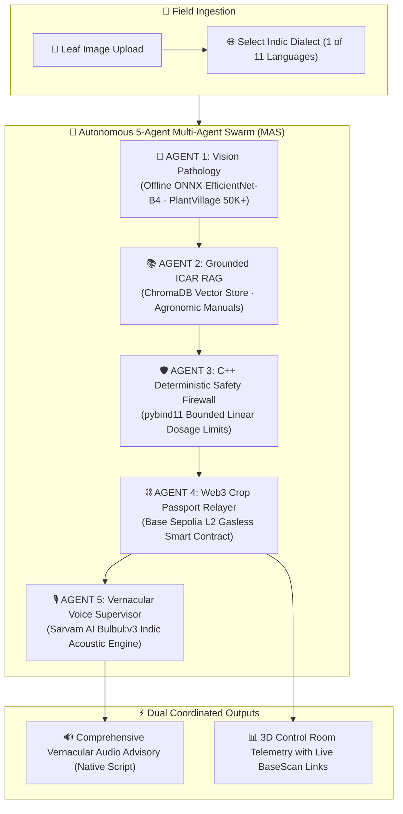

<div align="center">

  <h1>🌾 AgriNexus</h1>

  <p align="center">
    <strong>Autonomous Multi-Agent Agronomy, Deterministic Safety Engine & Zero-Trust Supply Chain Infrastructure</strong>
  </p>

  <p align="center">
    <a href="https://sepolia.basescan.org/address/0xDd819A09aff9A62D1F6Ad662c6cC34d4B5D7DAd7"></a>
    <a href="https://sarvam.ai"></a>
    <a href="https://onnxruntime.ai"></a>
    <a href="https://isocpp.org"></a>
    <a href="https://fastapi.tiangolo.com"></a>
    <a href="https://react.dev"></a>
  </p>

</div>

---

> [!IMPORTANT]
> **Core Architectural Philosophy:** *Maximum Backend Complexity, Zero Frontend Friction.*  
> A farmer in rural Punjab or Andhra Pradesh does not manage crypto wallets, pay gas fees, navigate multi-step forms, or read dense scientific manuals. They simply select their native dialect and upload a photo of a diseased crop. Behind the scenes, an autonomous 5-agent AI swarm, a compiled C++ safety firewall, and an immutable Ethereum L2 ledger validate the diagnosis and return an authentic, spoken vernacular voice advisory.

---

## 📌 Table of Contents
1. [The Crisis in Modern Agriculture (The Problem)](#-the-crisis-in-modern-agriculture-the-problem)
2. [The AgriNexus Innovation (The Solution)](#-the-agrinexus-innovation-the-solution)
3. [The 5-Agent Swarm Architecture](#-the-5-agent-swarm-architecture)
4. [Live Blockchain Traceability (Base Sepolia)](#-live-blockchain-traceability-base-sepolia)
5. [11-Language Indic Voice Matrix (Sarvam AI)](#-11-language-indic-voice-matrix-sarvam-ai)
6. [3D Telemetry Control Room & Farmer UI](#-3d-telemetry-control-room--farmer-ui)
7. [Quick Start & Setup Guide](#-quick-start--setup-guide)

---

## 🚨 The Crisis in Modern Agriculture (The Problem)

Smallholder farmers manage over 80% of farmland in developing nations, yet face systemic roadblocks that cause over **$29 Billion in annual crop losses**:

1. **Diagnostic Latency & Rapid Pathogen Spread:**  
   Plant diseases like Late Blight, Rust, and Powdery Mildew spread exponentially through fields. Physical agricultural extension officers are scarce, meaning farmers often receive diagnosis weeks too late when 40% to 70% of crop yield is already destroyed.
2. **Toxic Chemical Overdose & Soil Degradation:**  
   Lacking exact dosage formulas, farmers rely on guesswork or local dealer advice, often spraying 2x–5x the necessary chemical concentrations. This poisons groundwater, depletes soil biology, and creates pesticide-resistant super-pathogens.
3. **AI Hallucinations in Agronomy:**  
   Generic consumer AI models (like standard ChatGPT) hallucinate chemical recommendations, frequently suggesting banned, lethal chemicals (e.g. Endosulfan, Monocrotophos) that violate national statutory safety limits.
4. **Export Rejections & Lack of Traceability:**  
   Agricultural exports worth billions (Basmati Rice, Spices, Grapes) are routinely rejected at international ports (EU / US FDA) due to untraceable chemical residue exceeding Maximum Residue Limits (MRL).
5. **Linguistic Isolation:**  
   Over 60% of rural farmers cannot read English technical advisory sheets or chemical safety labels, cutting them off from modern scientific research.

---

## 💡 The AgriNexus Innovation (The Solution)

AgriNexus delivers a zero-trust, end-to-end autonomous pipeline engineered specifically for real-world farming constraints:

* **Instant Offline Edge Computer Vision:** Diagnoses 38 crop pathologies in ~80ms directly on the device using an optimized ONNX neural backbone without needing high-speed internet.
* **Deterministic C++ Safety Interlocks:** A native compiled C++17 firewall (`pybind11`) intercepts all AI proposals and enforces hard mathematical dosage boundaries based on field acreage and humidity, completely eliminating AI hallucinations.
* **Immutable Ethereum L2 Crop Passports:** Every verified treatment is cryptographically hashed and minted to Coinbase's **Base Sepolia** Layer-2 blockchain, providing tamper-proof provenance for insurance claims and international export certification.
* **Native Vernacular Voice Consultations:** Delivers comprehensive, colloquial audio consultations in **11 Indian Regional Languages** powered by Sarvam AI's **Bulbul:v3** neural acoustic model.

---

## 🤖 The 5-Agent Swarm Architecture



### Agent Responsibilities:
1. **Agent 1 (Offline Vision Pathology):** Runs tensor inference via an **EfficientNet-B4 ONNX** model trained on 50,000+ PlantVillage leaf images, with seamless fallback to Gemini Vision.
2. **Agent 2 (Grounded ICAR RAG):** Queries an embedded **ChromaDB** vector database seeded with official Indian Council of Agricultural Research (ICAR) guidelines.
3. **Agent 3 (Deterministic C++ Safety Core):** A compiled C++17 firewall that mathematically verifies and bounds chemical concentrations:
   $$\text{Safe Dosage } (D) = \min \left( D_{\text{RAG}}, \frac{C_{\text{max}} \times A}{\text{Dilution Factor}} \right)$$
4. **Agent 4 (Web3 Immutable Passport):** Mints a permanent cryptographic passport record on **Base Sepolia** using an autonomous gasless relayer.
5. **Agent 5 (Vernacular Voice Synthesizer):** Generates in-depth 4-part voice consultations (cause, dosage, water dilution, field precautions) via **Sarvam AI (Bulbul:v3)**.

---

## ⛓️ Live Blockchain Traceability (Base Sepolia)

Every crop diagnosis is permanently recorded on Coinbase's **Base Sepolia** Ethereum Layer-2 blockchain:

| Property | On-Chain Detail |
| :--- | :--- |
| **Smart Contract** | `CropPassport.sol` (Solidity 0.8.20 + OpenZeppelin) |
| **Contract Address** | [`0xDd819A09aff9A62D1F6Ad662c6cC34d4B5D7DAd7`](https://sepolia.basescan.org/address/0xDd819A09aff9A62D1F6Ad662c6cC34d4B5D7DAd7) |
| **Network** | Base Sepolia Testnet (Chain ID: `84532`) |
| **Explorer** | 👉 **[View Live Transactions on BaseScan](https://sepolia.basescan.org/address/0xDd819A09aff9A62D1F6Ad662c6cC34d4B5D7DAd7)** |

```solidity
struct PassportRecord {
    uint256 timestamp;       // Block timestamp of verified diagnosis
    string imageHash;        // SHA-256 fingerprint of the farmer's leaf photo
    string diagnosis;        // Pathology classification (e.g. "Tomato Late Blight")
    string treatmentHash;    // Cryptographic hash of prescribed ICAR treatment
    bool isSafe;             // Verified safe flag from C++ safety core
}
```

---

## 🎙️ 11-Language Indic Voice Matrix (Sarvam AI)

AgriNexus natively speaks and writes in **11 Indian Regional Languages** powered by Sarvam AI's **Bulbul:v3** neural model:

| Language | Native Script | Agronomic Greeting | Language | Native Script | Agronomic Greeting |
| :--- | :--- | :--- | :--- | :--- | :--- |
| **Hindi** | हिन्दी | किसान भाई | **Bengali** | বাংলা | কৃষক ভাইয়েরা |
| **Punjabi** | ਪੰਜਾਬੀ | ਕਿਸਾਨ ਵੀਰੋ | **Marathi** | मराठी | शेतकरी मित्रांनो |
| **Telugu** | తెలుగు | రైతు సోదరులారా | **Gujarati** | ગુજરાતી | ખેડૂત મિત્રો |
| **Tamil** | தமிழ் | விவசாய சகோதரர்களே | **Odia** | ଓଡ଼ିଆ | କୃଷକ ଭାଇମାନେ |
| **Malayalam** | മലയാളം | കർഷക സുഹൃത്തുക്കളെ | **English** | English | Dear Farmer |
| **Kannada** | ಕನ್ನಡ | ರೈತ ಮಿತ್ರರೇ | | | |

---

## 🖥️ 3D Telemetry Control Room & Farmer UI

* **Farmer Field Interface ([`FarmerView.jsx`](file:///c:/Users/vansh/OneDrive/Desktop/AgriNexus/frontend/src/components/FarmerView.jsx)):** Mobile-responsive, single-tap photo upload, horizontal bilingual language badges, dynamic agent status indicators, and an automated audio player.
* **Swarm Control Room ([`TelemetryView.jsx`](file:///c:/Users/vansh/OneDrive/Desktop/AgriNexus/frontend/src/components/TelemetryView.jsx)):** Real-time 3D cybernetic canvas featuring **progressive 850ms laser line propagation**, dynamic bot movements (orbital wobble, vertical float, shield rotation, 3D tilt, harmonic sound ripples), and a live cryptographic ledger with direct `[BaseScan ↗]` one-click explorer links.

---

## ⚡ Quick Start & Setup Guide

### 1. Configure Environment (`backend/.env`):
```env
SARVAM_API_KEY=your_sarvam_api_key_here
GOOGLE_API_KEY=your_gemini_api_key_here
BASE_SEPOLIA_RPC_URL=https://sepolia.base.org
DEVELOPER_PRIVATE_KEY=your_wallet_private_key_here
CROP_PASSPORT_CONTRACT_ADDRESS=0xDd819A09aff9A62D1F6Ad662c6cC34d4B5D7DAd7
```

### 2. Launch Backend (FastAPI + LangGraph):
```bash
cd backend
python -m venv venv
# Windows: venv\Scripts\activate | Linux/macOS: source venv/bin/activate
pip install -r requirements.txt
python main.py
```
*Backend runs on `http://localhost:8000` with WebSocket telemetry at `ws://localhost:8000/ws/telemetry`.*

### 3. Launch Frontend (React + Vite):
```bash
cd ../frontend
npm install
npm run dev
```
*Frontend runs on `http://localhost:5173`.*

---

## 📄 License
Distributed under the **MIT License**.