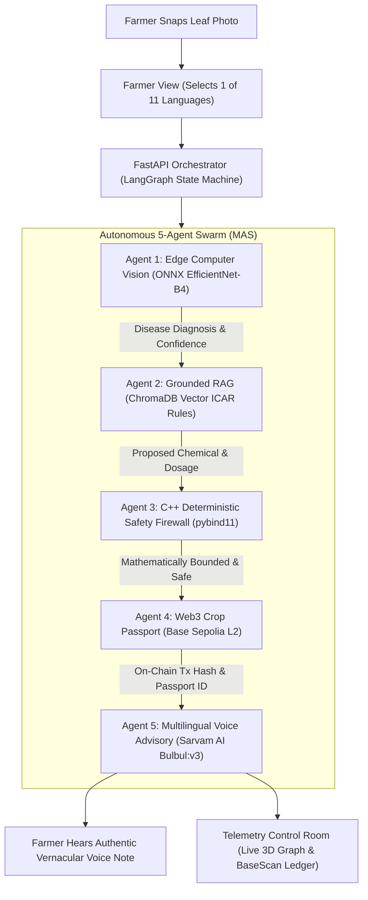

<div align="center">

  <h1>🌾 AgriNexus</h1>

  <p align="center">
    <strong>Autonomous Multi-Agent Agronomy, Deterministic Safety Engine & Zero-Trust Supply Chain Infrastructure</strong>
  </p>

  <p align="center">
    An enterprise-grade, polyglot agricultural intelligence system combining <strong>Offline Edge Computer Vision</strong>, <strong>C++ Deterministic Safety Interlocks</strong>, <strong>Live Ethereum L2 Blockchain Traceability</strong>, and <strong>Multilingual Indic Voice Synthesis</strong> across 11 regional languages.
  </p>

  <p align="center">
    <a href="https://sepolia.basescan.org/address/0xDd819A09aff9A62D1F6Ad662c6cC34d4B5D7DAd7"></a>
    <a href="https://sarvam.ai"></a>
    <a href="https://onnxruntime.ai"></a>
    <a href="https://isocpp.org"></a>
    <a href="https://fastapi.tiangolo.com"></a>
    <a href="https://react.dev"></a>
  </p>

</div>

---

> [!IMPORTANT]
> **Core Architectural Philosophy:** *Maximum Backend Complexity, Zero Frontend Friction.*  
> A farmer in rural Punjab or Andhra Pradesh does not manage crypto wallets, pay gas fees, navigate multi-step forms, or read dense scientific manuals. They simply select their native language and upload a photo of a diseased leaf. Behind the scenes, an autonomous 5-agent AI swarm, a compiled C++ safety firewall, and an immutable Ethereum L2 ledger validate the diagnosis and return an authentic, spoken vernacular voice advisory.

---

## 📌 Table of Contents
1. [The Crisis in Modern Agriculture (Problem Statement)](#-the-crisis-in-modern-agriculture-problem-statement)
2. [How AgriNexus Works (System Overview)](#-how-agrinexus-works-system-overview)
3. [The 5-Agent Autonomous Swarm Architecture](#-the-5-agent-autonomous-swarm-architecture)
4. [Mathematical Safety Engine (C++17 Core)](#-mathematical-safety-engine-c17-core)
5. [Live Blockchain Traceability & Crop Passports](#-live-blockchain-traceability--crop-passports)
6. [Multilingual Indic Voice Advisory (Sarvam AI)](#-multilingual-indic-voice-advisory-sarvam-ai)
7. [Cinematic 3D Telemetry Control Room](#-cinematic-3d-telemetry-control-room)
8. [Real-World Impact & Supply Chain Use Cases](#-real-world-impact--supply-chain-use-cases)
9. [Repository Structure](#-repository-structure)
10. [Local Development & Quick Start](#-local-development--quick-start)

---

## 🚨 The Crisis in Modern Agriculture (Problem Statement)

Smallholder farming accounts for over 80% of agricultural production in developing nations, yet farmers face compounding systemic failures:

1. **Diagnostic Latency & Yield Destruction ($29B+ Annual Loss):**  
   Plant pathogens spread exponentially. By the time a physical agricultural extension officer visits a remote farm, foliar diseases (such as Late Blight or Stripe Rust) have often destroyed 40% to 70% of crop yield.
2. **Toxic Chemical Overuse & Ground Toxicity:**  
   Without precise dosage guidance, farmers frequently over-apply hazardous fungicides, contaminating groundwater, destroying soil microbiomes, and creating pesticide-resistant super-pathogens.
3. **LLM Hallucinations in Agronomy:**  
   Standard consumer AI chatbots (like raw ChatGPT) frequently hallucinate chemical formulations or recommend banned, lethal chemical ratios (e.g. Endosulfan or Monocrotophos) that violate national statutory limits.
4. **Supply Chain Fraud & Export Rejection:**  
   Export consignments worth billions (e.g., Basmati Rice, Spices, Table Grapes) are routinely rejected at international ports (EU/US FDA) due to untraceable chemical residue exceeding Maximum Residue Limits (MRL).
5. **Literacy & Linguistic Barriers:**  
   Over 60% of rural farmers cannot read English technical advisories or dense pesticide chemical labels, creating an urgent need for dialect-accurate spoken consultations.

---

## 🌾 How AgriNexus Works (System Overview)

AgriNexus unifies **Edge AI, Vector Retrieval, Deterministic Systems Engineering, Web3 Ledger Technology, and Acoustic Speech Synthesis** into a single autonomous pipeline:



---

## 🤖 The 5-Agent Autonomous Swarm Architecture

```
[ Field Image Input ]
        │
        ▼
┌──────────────────────────────────────────────┐
│  AGENT 1: Vision Pathology (Offline Edge AI) │ ──► EfficientNet-B4 ONNX Inference (PlantVillage 50K+)
└──────────────────────┬───────────────────────┘
                       ▼
┌──────────────────────────────────────────────┐
│  AGENT 2: Grounded ICAR RAG Intelligence     │ ──► ChromaDB Vector Store Cosine Similarity Match
└──────────────────────┬───────────────────────┘
                       ▼
┌──────────────────────────────────────────────┐
│  AGENT 3: C++ Deterministic Safety Engine    │ ──► pybind11 Bounded Linear Dosage Firewall
└──────────────────────┬───────────────────────┘
                       ▼
┌──────────────────────────────────────────────┐
│  AGENT 4: Web3 Immutable Crop Passport       │ ──► Base Sepolia L2 Gasless Smart Contract Relayer
└──────────────────────┬───────────────────────┘
                       ▼
┌──────────────────────────────────────────────┐
│  AGENT 5: Vernacular Voice Synthesizer       │ ──► Sarvam AI Bulbul:v3 Multilingual Audio (11 Langs)
└──────────────────────┬───────────────────────┘
                       ▼
    [ Regional Audio Advisory Delivered ]
```

### 1. Agent 1 — Vision Pathology (Offline Edge AI Engine)
* **Model:** Deep **EfficientNet-B4** Convolutional Neural Network exported to optimized **ONNX** runtime format.
* **Dataset:** Trained on 50,000+ real crop leaf images from the **PlantVillage** dataset across 38 crop disease classes.
* **Edge-to-Cloud Fallback:** Performs offline local tensor inference in raw Numpy (`float32` ImageNet standardization) in ~80ms without needing GPUs or heavy PyTorch backend dependencies. If offline inference is unavailable, it gracefully routes to Gemini 1.5 Flash.

### 2. Agent 2 — Grounded Agronomy RAG (Vector Intelligence)
* **Vector Store:** Embedded **ChromaDB** database populated with official **ICAR (Indian Council of Agricultural Research)** and **CIB&RC** agronomy manuals.
* **Cosine Similarity Search:** Matches disease classifications with verified active chemical ingredients, certified base dosages, dilution factors, and weather thresholds.

### 3. Agent 3 — Deterministic C++ Safety Engine (The Firewall)
* **Architecture:** Native compiled **C++17/C++20** binary exposed to Python via **`pybind11`**.
* **Zero LLM Trust Policy:** Intercepts RAG suggestions and subjects them to strict mathematical dosage bounding, humidity-based dilution adjustments, and toxicity bans. It can hard-override any upstream AI hallucination.

### 4. Agent 4 — Web3 Immutable Crop Passport (Ethereum L2)
* **Network:** **Base Sepolia (Ethereum Layer-2)** for sub-cent gas fees and instant block finality.
* **Gasless Relayer:** Uses an autonomous backend relayer wallet so the farmer never needs a crypto wallet or gas tokens.
* **Cryptographic Proof of State:** Hashes the raw leaf image (SHA-256) and the verified dosage, permanently minting a supply-chain health passport on-chain.

### 5. Agent 5 — Vernacular Voice Synthesis (Sarvam AI)
* **Speech Model:** **Sarvam AI (Bulbul:v3)** Indic neural voice model.
* **Comprehensive Advisory:** Translates diagnostics into a structured 4-part agronomic advisory (disease cause, certified dosage, water mixing ratios, and field application precautions) across 11 Indian regional languages.

---

## 🔒 Mathematical Safety Engine (C++17 Core)

To ensure zero toxic chemical accidents, AgriNexus implements hard mathematical constraints in native compiled C++:

$$\text{Safe Dosage } (D) = \min \left( D_{\text{RAG}}, \frac{C_{\text{max}} \times A}{\text{Dilution Factor}} \right) \times \left(1.0 - \max\left(0, \frac{H - H_{\text{threshold}}}{100}\right)\right)$$

Where:
* $D_{\text{RAG}}$: Dosage suggested by vector retrieval (ml/acre).
* $C_{\text{max}}$: Statutory maximum active ingredient per acre under ICAR / CIB&RC regulations.
* $A$: Total field acreage.
* $H$: Current atmospheric relative humidity percentage.
* If $D_{\text{RAG}} > D$, the C++ module automatically rejects the proposal, clamps the dosage to $D$, and attaches an immutable safety warning.

---

## ⛓️ Live Blockchain Traceability & Crop Passports

AgriNexus creates an immutable supply-chain record for every crop scan on Coinbase's **Base Sepolia** Ethereum Layer-2 network.

| Property | On-Chain Detail |
| :--- | :--- |
| **Smart Contract** | `CropPassport.sol` (Solidity 0.8.20 + OpenZeppelin Ownable) |
| **Contract Address** | [`0xDd819A09aff9A62D1F6Ad662c6cC34d4B5D7DAd7`](https://sepolia.basescan.org/address/0xDd819A09aff9A62D1F6Ad662c6cC34d4B5D7DAd7) |
| **Network** | Base Sepolia Testnet (Chain ID: `84532`) |
| **Block Explorer** | [View on BaseScan](https://sepolia.basescan.org/address/0xDd819A09aff9A62D1F6Ad662c6cC34d4B5D7DAd7) |

### On-Chain Data Schema:
```solidity
struct PassportRecord {
    uint256 timestamp;       // Block timestamp of verified diagnosis
    string imageHash;        // SHA-256 fingerprint of the farmer's raw leaf photo
    string diagnosis;        // Pathology classification (e.g. "Tomato Late Blight")
    string treatmentHash;    // Cryptographic hash of prescribed ICAR treatment
    bool isSafe;             // Verified safe flag from C++ safety core
}
```

---

## 🎙️ Multilingual Indic Voice Advisory (Sarvam AI)

AgriNexus natively supports **11 Indian Regional Languages** powered by Sarvam AI's **Bulbul:v3** neural model:

| Language | Code | Native Script | Agronomic Greeting |
| :--- | :--- | :--- | :--- |
| **Hindi** | `hi-IN` | हिन्दी | किसान भाई |
| **Punjabi** | `pa-IN` | ਪੰਜਾਬੀ | ਕਿਸਾਨ ਵੀਰੋ |
| **Telugu** | `te-IN` | తెలుగు | రైతు సోదరులారా |
| **Tamil** | `ta-IN` | தமிழ் | விவசாய சகோதரர்களே |
| **Malayalam** | `ml-IN` | മലയാളം | കർഷക സുഹൃത്തുക്കളെ |
| **Kannada** | `kn-IN` | ಕನ್ನಡ | ರೈತ ಮಿತ್ರರೇ |
| **Bengali** | `bn-IN` | বাংলা | কৃষক ভাইয়েরা |
| **Marathi** | `mr-IN` | मराठी | शेतकरी मित्रांनो |
| **Gujarati** | `gu-IN` | ગુજરાતી | ખેડૂત મિત્રો |
| **Odia** | `od-IN` | ଓଡ଼ିଆ | କୃଷକ ଭାଇମାନେ |
| **Indian English** | `en-IN` | English | Dear Farmer |

---

## 🖥️ Cinematic 3D Telemetry Control Room

The AgriNexus web application features dual synced interfaces:

1. **Farmer Field Workspace ([`FarmerView.jsx`](file:///c:/Users/vansh/OneDrive/Desktop/AgriNexus/frontend/src/components/FarmerView.jsx)):**  
   Mobile-optimized interface with single-tap photo upload, horizontal bilingual language pills, real-time agent status animations, and automated audio player.
2. **Swarm Telemetry Control Room ([`TelemetryView.jsx`](file:///c:/Users/vansh/OneDrive/Desktop/AgriNexus/frontend/src/components/TelemetryView.jsx)):**  
   * **3D Perspective Moving Cybernetic Grid:** Infinite scrolling spatial grid with deep ambient nebula glows.
   * **Progressive 850ms Laser Line Propagation:** Connection lines dynamically draw across the screen only as agents complete their tasks.
   * **Active Agent Choreography:** Each bot executes distinct continuous active motions (Vision orbital wobble, RAG vertical floating, Safety shield rotation, Web3 diamond tilt, and Voice harmonic soundwave ripples).
   * **Live Cryptographic Ledger:** Real-time terminal with one-click `[BaseScan ↗]` direct blockchain links.

---

## 🌍 Real-World Impact & Supply Chain Use Cases

* **APEDA / FSSAI Export Quality Compliance:**  
  Provides immutable on-chain chemical passports proving zero banned pesticide application, eliminating multimillion-dollar export consignment rejections.
* **PMFBY Crop Insurance Acceleration:**  
  Timestamped on-chain disease records serve as mathematical proof of crop damage for rapid insurance claim settlements.
* **Anti-Counterfeit Pesticide Verification:**  
  Verifies authorized chemical formulations and exact safe dilution metrics, stopping spurious pesticide distribution in rural markets.
* **Carbon Credits & Sustainable Soil Health:**  
  Maintains verified non-toxic farming records eligible for global green agriculture carbon credits.

---

## 📂 Repository Structure

```text
AgriNexus/
├── backend/                        # FastAPI Application & LangGraph Orchestration Swarm
│   ├── app/
│   │   ├── agents/                 # Autonomous Swarm Nodes (Agents 1 through 5)
│   │   │   ├── vision_agent.py     # Edge ONNX EfficientNet-B4 + Cloud Fallback
│   │   │   ├── rag_agent.py        # ICAR Vector Retrieval Engine
│   │   │   ├── safety_agent.py     # C++ Safety Core Integration
│   │   │   ├── web3_agent.py       # Base Sepolia Blockchain Relayer
│   │   │   ├── voice_agent.py      # 11-Language Sarvam AI Voice Pipeline
│   │   │   └── graph.py            # LangGraph State Machine Graph
│   │   ├── api/
│   │   │   └── routes.py           # REST & WebSocket Telemetry Gateway
│   │   ├── cpp_core/               # C++17 Deterministic Mathematical Safety Engine
│   │   │   ├── src/safety_rules.cpp
│   │   │   └── bindings.cpp        # pybind11 Python C++ Bridge
│   │   ├── services/
│   │   │   ├── chroma_db.py        # ChromaDB Vector Store
│   │   │   ├── tts_client.py       # Sarvam AI Bulbul:v3 & Edge-TTS Client
│   │   │   └── web3_client.py      # Web3.py Base L2 Contract Bridge
│   │   └── state.py                # TypedDict Swarm State Management
│   ├── ml_model/                   # Deployed ONNX Models & Class Mappings
│   │   ├── agrinexus_vision.onnx   # Optimized EfficientNet-B4 Weights
│   │   └── class_mapping.json      # 38 Plant Pathology Classes
│   ├── main.py                     # Backend Server Entrypoint
│   └── requirements.txt            # Python Dependencies
├── contracts/                      # Hardhat EVM Blockchain Suite
│   ├── contracts/
│   │   └── CropPassport.sol        # Solidity Smart Contract (Base Sepolia)
│   ├── scripts/
│   │   └── deploy.js               # Base Sepolia Deployment Script
│   └── hardhat.config.js           # Hardhat Network & Compiler Configuration
├── frontend/                       # Vite + React + Tailwind CSS Web Application
│   ├── src/
│   │   ├── components/
│   │   │   ├── FarmerView.jsx      # Mobile Field Interface with Indic Audio
│   │   │   └── TelemetryView.jsx   # 3D Spatial MAS Control Room
│   │   ├── services/
│   │   │   └── api.js              # REST & WebSocket Client
│   │   ├── App.jsx                 # Dual Split-Screen & Mobile Tab Layout
│   │   └── index.css               # Cybernetic Tailwind Resets
│   └── package.json                # Frontend Dependencies
└── ml_pipeline/                    # Cloud ML Training Pipeline
    └── train_efficientnet.py       # PyTorch PlantVillage 50K Training Script
```

---

## ⚡ Local Development & Quick Start

### Prerequisites
* **Python:** 3.10+ (Tested on 3.12)
* **Node.js:** 18+ & npm
* **C++ Compiler:** `g++`, `clang`, or MSVC with C++17 support
* **MetaMask:** (Optional, for Base Sepolia testnet interactions)

---

### 1. Clone the Repository
```bash
git clone https://github.com/Player1205/AgriNexus.git
cd AgriNexus
```

### 2. Configure Backend Environment
Create `backend/.env`:
```env
SARVAM_API_KEY=your_sarvam_api_key_here
GOOGLE_API_KEY=your_gemini_api_key_here
BASE_SEPOLIA_RPC_URL=https://sepolia.base.org
DEVELOPER_PRIVATE_KEY=your_wallet_private_key_here
CROP_PASSPORT_CONTRACT_ADDRESS=0xDd819A09aff9A62D1F6Ad662c6cC34d4B5D7DAd7
```

### 3. Launch the Backend
```bash
cd backend
python -m venv venv
# Windows:
venv\Scripts\activate
# Linux/macOS:
source venv/bin/activate

pip install -r requirements.txt
python main.py
```
*Backend runs on `http://localhost:8000` with WebSocket telemetry at `ws://localhost:8000/ws/telemetry`.*

### 4. Launch the React Frontend
```bash
cd ../frontend
npm install
npm run dev
```
*Frontend runs on `http://localhost:5173`.*

---

## 📄 License

Distributed under the **MIT License**. See `LICENSE` for more information.

---

<div align="center">
  <strong>AgriNexus</strong> — <i>Building the Autonomous, Transparent, and Safe Future of Global Agriculture.</i>
</div>