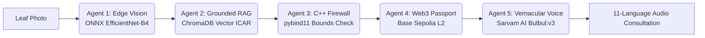

<div align="center">

  <h1>🌾 AgriNexus</h1>

  <p align="center">
    <strong>Autonomous Multi-Agent Agronomy, Deterministic Safety Engine & Zero-Trust Supply Chain Infrastructure</strong>
  </p>

  <p align="center">
    <a href="https://sepolia.basescan.org/address/0xDd819A09aff9A62D1F6Ad662c6cC34d4B5D7DAd7"></a>
    <a href="https://sarvam.ai"></a>
    <a href="https://onnxruntime.ai"></a>
    <a href="https://isocpp.org"></a>
    <a href="https://fastapi.tiangolo.com"></a>
    <a href="https://react.dev"></a>
  </p>

</div>

---

> [!IMPORTANT]
> **The Philosophy:** *Maximum Backend Complexity, Zero Frontend Friction.*  
> A farmer simply selects their language and snaps a photo of a diseased leaf. Behind the scenes, an autonomous 5-agent AI swarm, a compiled C++ safety firewall, and an immutable Ethereum L2 blockchain validate the diagnosis and return an authentic, spoken vernacular voice advisory.

---

## 🎯 The Problem vs. Solution

| The Crisis in Agriculture | How AgriNexus Solves It |
| :--- | :--- |
| **Diagnostic Latency ($29B Crop Loss)** | **Offline Edge AI (ONNX EfficientNet-B4)** runs in ~80ms without cloud dependency. |
| **LLM Chemical Hallucinations** | **C++17 Safety Firewall (`pybind11`)** mathematically clamps chemical dosage to statutory ICAR limits. |
| **Export Rejections & Supply Fraud** | **Base Sepolia L2 Blockchain** creates immutable, tamper-proof Crop Health Passports. |
| **Literacy & Language Barriers** | **Sarvam AI (Bulbul:v3)** delivers rich, spoken voice advisories in **11 Indian Regional Languages**. |

---

## 🤖 The 5-Agent Swarm Architecture



1. **Agent 1 (Offline Edge Vision):** Analyzes leaf tissue using an ONNX-optimized **EfficientNet-B4** model trained on 50,000+ PlantVillage images (with Gemini cloud fallback).
2. **Agent 2 (Grounded ICAR RAG):** Queries an embedded **ChromaDB** vector store containing official ICAR agricultural research guidelines.
3. **Agent 3 (C++ Deterministic Safety Core):** Intercepts proposed treatments and enforces linear mathematical bounds on chemical dilution, overriding any potential AI errors.
4. **Agent 4 (Web3 Immutable Passport):** Mints a cryptographically hashed crop health record to **Base Sepolia** via gasless account abstraction.
5. **Agent 5 (Multilingual Voice Supervisor):** Synthesizes a structured 4-part agronomic advisory (diagnosis, dosage, water mixing, precautions) via **Sarvam AI Bulbul:v3**.

---

## ⛓️ Live Smart Contract on Base Sepolia

Every verified crop scan is permanently recorded on Coinbase's **Base Sepolia** Ethereum Layer-2 network:

* **Contract Address:** [`0xDd819A09aff9A62D1F6Ad662c6cC34d4B5D7DAd7`](https://sepolia.basescan.org/address/0xDd819A09aff9A62D1F6Ad662c6cC34d4B5D7DAd7)
* **Live Explorer:** 👉 **[View Transactions on BaseScan](https://sepolia.basescan.org/address/0xDd819A09aff9A62D1F6Ad662c6cC34d4B5D7DAd7)**

```solidity
struct PassportRecord {
    uint256 timestamp;       // Block timestamp of verified diagnosis
    string imageHash;        // SHA-256 fingerprint of the farmer's leaf photo
    string diagnosis;        // Pathology classification (e.g. "Tomato Late Blight")
    string treatmentHash;    // Cryptographic hash of prescribed ICAR treatment
    bool isSafe;             // Verified safe flag from C++ safety core
}
```

---

## 🎙️ 11-Language Indic Voice Matrix (Sarvam AI)

| Language | Native Script | Greeting | Language | Native Script | Greeting |
| :--- | :--- | :--- | :--- | :--- | :--- |
| **Hindi** | हिन्दी | किसान भाई | **Bengali** | বাংলা | কৃষক ভাইয়েরা |
| **Punjabi** | ਪੰਜਾਬੀ | ਕਿਸਾਨ ਵੀਰੋ | **Marathi** | मराठी | शेतकरी मित्रांनो |
| **Telugu** | తెలుగు | రైతు సోదరులారా | **Gujarati** | ગુજરાતી | ખેડૂત મિત્રો |
| **Tamil** | தமிழ் | விவசாய சகோதரர்களே | **Odia** | ଓଡ଼ିଆ | କୃଷକ ଭାଇମାନେ |
| **Malayalam** | മലയാളം | കർഷക സുഹൃത്തുക്കളെ | **English** | English | Dear Farmer |
| **Kannada** | ಕನ್ನಡ | ರೈತ ಮಿತ್ರರೇ | | | |

---

## 🖥️ Dual Workspace & 3D Telemetry UI

* **Farmer Field View:** Mobile-optimized, single-tap photo capture, bilingual language pills, and instant audio playback.
* **Swarm Telemetry Control Room:** Dark-mode 3D cybernetic canvas featuring **progressive 850ms laser line propagation**, dynamic bot movements (orbit, vertical float, shield circle, 3D tilt, audio ripples), and a live cryptographic ledger with direct `[BaseScan ↗]` links.

---

## ⚡ Quick Start

### 1. Configure Environment (`backend/.env`):
```env
SARVAM_API_KEY=your_sarvam_api_key
BASE_SEPOLIA_RPC_URL=https://sepolia.base.org
DEVELOPER_PRIVATE_KEY=your_wallet_private_key
CROP_PASSPORT_CONTRACT_ADDRESS=0xDd819A09aff9A62D1F6Ad662c6cC34d4B5D7DAd7
```

### 2. Run Backend:
```bash
cd backend
pip install -r requirements.txt
python main.py
```

### 3. Run Frontend:
```bash
cd frontend
npm install
npm run dev
```

---

## 📄 License
Distributed under the **MIT License**.